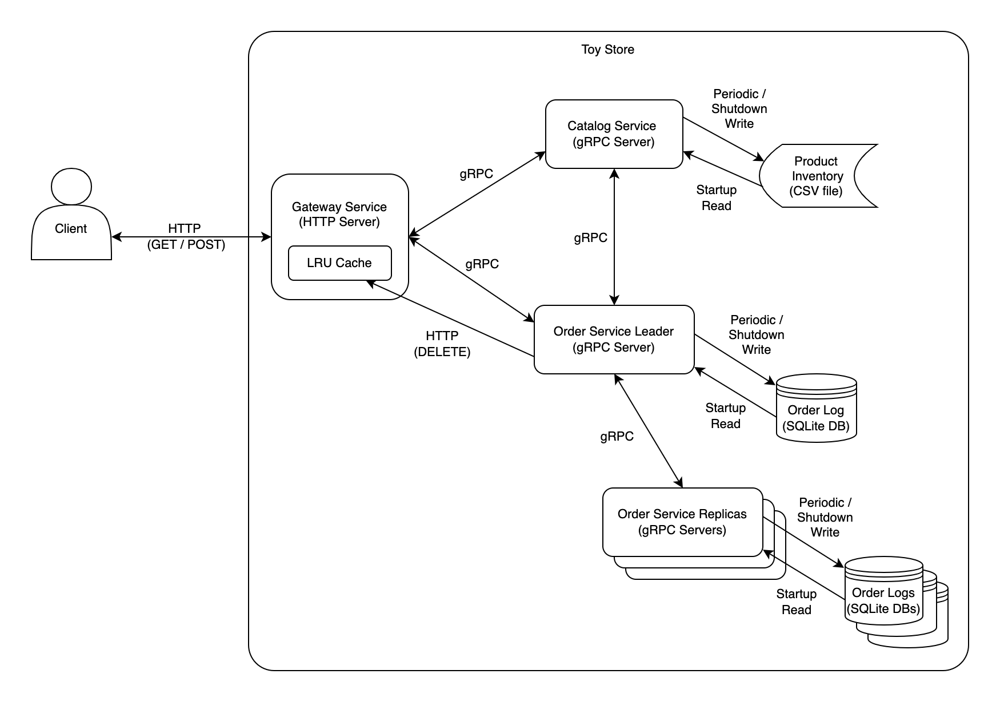

# Microservice-Based Toy Store

## Table of Contents
- [Introduction](#introduction)
- [Goals and Objectives](#goals-and-objectives)
- [Solution Overview](#solution-overview)
   - [Client Perspective](#client-perspective)
   - [Solution Structure](#solution-structure)
- [Technologies](#technologies)
- [Design Details](#design-details)
   - [Gateway Service](#gateway-service)
     - [LRU Cache](#lru-cache)
   - [Leader Election](#leader-election)
   - [Catalog Service](#catalog-service)
   - [Order Service](#order-service)
      - [Replication](#replication)
- [Client](#client)
- [Testing](#testing)
- [Build Tools and Packaging](#build-tools-and-packaging)
- [Containerization](#containerization)
   - [Docker Image Build](#docker-image-build)
   - [Docker Compose](#docker-compose)

## Introduction

This project implements a web application backend for a fictional online
toy store using a multi-tier architecture 
with containerized microservices that communicate via gRPC. It also includes a simulated 
client program that sends requests to the backend via an HTTP-based REST API.
Load test are performed by running concurrent simulated clients via a bash script
to examine the latency impacts of increasing users.

## Goals and objectives

1. Design a distributed server application using a multi-tier architecture and 
containerized microservices. 

   
2. Implement a custom cache to improve request latency and reduce microservice communication overhead.


3. Replicate one of the microservices to provide fault tolerance for that service.


4. Explore performance impacts of increasing users.

## Solution Overview

### Client Perspective

The online toy store maintains the price and stock of 10 different products.
There are several actions that a client may perform while interacting with the store:

1. A client may query the store for the price and quantity of a product.
2. A client may purchase a specified quantity of a product.
3. A client may query the store for the price, quantity, and product purchased 
for a specific order made on the store (specified by a unique order number).

### Solution Structure

The store is implemented as three containerized microservices which communicate with each other
via gRPC to service incoming client requests. These microservices are: 

1. **Gateway Service**: This service exposes an HTTP REST API for clients to make requests.
It forwards these requests to the appropriate handler service, processes the responses from the handler service, 
and sends a response back to the client. The Gateway
Service also maintains a cache of recently made queries and responses to improve latency.


2. **Catalog Service**: This service handles product queries (client action #1), maintains the product catalog 
which keeps the price and stock of each item, and handles decrementing stock for purchases requested 
by the order service.


3. **Order Service**: Handles product purchases (client action #2), maintains a log of completed orders, and handles 
order queries (client action #3). The Order Service is made fault tolerant via replication. One Order Service instance
is elected to serve as the leader by the Gateway Service, and this leader propagates changes in its order log
to the other Order Service replicas.

A simulated client code sends various types of requests to the Gateway Service, and
multiple simulated clients may be started concurrently to observe the store's ability to handle concurrent requests.
The diagram below provides a high level overview of the client, the microservices, and their communication 
patterns:



### Technologies

The microservices and the simulated client are written in Java, which provides a good interface 
for communication via HTTP and is compatible with gRPC, an efficient service communication method. 
Maven is used as a build tool for ease of package management and installation. 
For testing, a bash script is used to simulate multiple concurrent clients sending requests. 
Python is then used to read latency data from these tests and generate plots using Matplotlib.

## Design Details 

### Gateway Service
The Main class of the Gateway server uses Java's HTTPServer to listen for incoming 
HTTP requests from the client on a specified port. It uses a ThreadPoolExecutor to 
instantiate java's built-in thread pool to handle concurrent requests. It also instantiates three 
separate HttpHandlers and maps them to uri's for handling client requests:

1. **ProductsHandler/CachingProductsHandler**: Depending on whether caching has been enabled, either a ProductsHandler
or a CachingProductsHandler will be assigned to service client product query requests. 
Specifically, these handlers handle HTTP GET requests of the form: 
`GET /products/<product_name>` by communicating with the Catalog Service via a gRPC stub.
When a request comes in, the handler extracts the product name from the client URI, constructs 
a CatalogQueryRequest object, and calls
the catalog stub's `query` method on this object (following the interface defined by the
catalog service in the `catalogservice.proto` file). On response from the catalog, it either returns
the data for the specified product to the client via HttpResponse in the JSON form specified below:

   ```json
    {
        "data": {
            "name": "Tux",
            "price": 15.99,
            "quantity": 100
        }
    }
   ```

   or it returns an error object in this form if the product does not exist:

   ```json
    {
        "error": {
            "code": 404,
            "message": "product not found"
        }
    }
   ```
   If caching is enabled, the Main class will maintain a cache of recent product query responses, 
   and the CachingProductsHandler will check this cache before contacting the Catalog Service. Upon a cache hit,
   the handler will respond to the client directly with the response from the cache. Upon a miss, it will call
   the Catalog Service stub's `query` method as described above, and will add the response to the cache before responding to
   the client. The cache implementation is detailed in the **LRU Cache** section below.


2. **OrdersHandler**: This handler is assigned to service client purchase (order) requests. 
Specifically, it handles HTTP POST requests of the form:
   `POST /orders`, with
   an attached JSON body of the form:

   ```json
   {
      "name": "Tux",
      "quantity": 1
   }
   ```
   by communicating with the leader Order Service via a gRPC stub (again, the Order Service is replicated and 
the leader election mechanism is detailed in the **Leader Election** section below). 
   It does so by extracting the product name and quantity 
   from the client request body, constructing a OrderBuyRequest object, 
   and calling the leader Order Service stub's `buy` method on this object (following the interface defined by the
   order service in the `orderservice.proto` file). On response from the Order Service, it will then either return the order
   number to the client via HttpResponse in the JSON form specified below:

   ```json
    {
        "data": {
            "order_number": 10
        }
    }
    ```
   or it will return an error object in the same form shown above for the ProductsHandler/CachingProductsHandler
   classes. The OrdersHandler is also assigned to service client order query requests of the form:
`GET orders/<order number>`. It again uses the leader Order Service's gRPC stub, this time calling the
   stub's `queryOrderNumber` method on a OrderQueryRequest object. On response from the Order Service, 
it will then either return the order information to the client via HttpResponse in the JSON form specified below:

   ```json
       {
      "data": {
         "number": 10,
         "name": "Tux",
         "quantity": 2
      }
   }
   ```
   or it will return an error object as described above.

3. **InvalidateHandler**: This handler is assigned to handle cache invalidation requests sent from the Catalog Service.
Specifically, it handles HTTP DELETE requests of the form: `DELETE /invalidate/<product name>`, which
are sent from the Catalog Service any time the stock of a product changes. Upon receiving an invalidation
request, the InvalidateHandler will remove the cache line associated with that product since it no longer
contains the correct product stock.

#### LRU Cache

As stated above, the Gateway Service contains a custom `LRUCache` which employs the 
Least Recently Used eviction policy to increase product query latency. The cache is implemented using java's 
built-in HashMap for constant time lookups and a custom queue data structure, `LRUQueue`, to maintain the
least recently used order. The queue is implemented as a doubly linked-list of `LRUNode`'s, which
encapsulate `Data` objects that contain the name, price, and quantity of an item in the store.
The HashMap maps the string name of a product to an `LRUNode` which holds data for that product. 
The cache has a configurable maximum size, and implements 3 core methods:

1. The `get` method attempts to retrieve the `Data` from a node in the cache corresponding to a product name, 
and upon a cache hit such node gets moved to the front of the queue. 


2. The `put` method adds or updates a node in the cache any time the Gateway Service receives a valid product query response
from the Catalog Service. If a node already exists for a product, that node will be updated and moved
to the front of the queue. Otherwise, a new node will be created, added to the HashMap and the front of the queue. 
If the cache is full when a new node is added, the last node in the 
queue will be evicted as it is the least recently accessed node. 


3. The `invalidate` method removes a node from the queue when the stock of a product
in the store changes. This method is called when the Catalog Service sends an invalidation 
request to the Gateway Service, notifying it that any cache entry associated with some product
has become invalid.

Each of these methods is synchronized to avoid race conditions since the cache is shared across 
concurrently executing handler threads. The cache can also be enabled or disabled on startup 
of the Gateway Service using the -cs command line argument.

#### Leader Election

The Order Service is made fault tolerant via replication, and the Gateway Service is tasked 
with electing a leader Order Service instance (node) on startup or when the previous leader fails.
In order to do this, the Gateway Service keeps a list of all Order Service nodes, each of
which has a unique ID, host address, and port number. This list is generated by 
the `OrderServiceNodesReader` class, which reads the Order Service nodes information from
configuration files in the `resources` directory on startup. The task of electing a leader
is handled by the `OrdersHandler`'s `electLeader` method. This
method iterates over the Order Service nodes, starting from the node with
the highest ID and continuing in descending order. It obtains a gRPC stub to each service
and calls the `checkHealth` method to check if that node is online. Once a node responds
that it is online, that node is elected the leader and its stub is kept in the `OrdersHandler`
as the new leader stub. Therefore, the online node with the highest ID is always elected
to be the leader. Finally, the `electLeader` method notifies the other online nodes
of the new leader by calling the `assignLeader` method on their stubs and passing a
`LeaderAssignment` object which contains the new leader ID. Again, the `electLeader` method
is triggered on startup or whenever the leader node stops responding to gRPC calls
from the Gateway Service. This means as long as at least one Order Service node is
online, the application may continue to function normally.

### Catalog Service
The Catalog Service implements a gRPC server in order to expose an interface for querying
products to the Gateway Service, and an interface for purchasing products to the Order Service.
These interfaces are defined as services in the `catalogservice.proto` file.
Similar to the Gateway Service, a `ThreadPoolExecutor` is used to generate a 
thread pool for handling concurrent RPCs. The interface methods are:

1. The `query` method queries the product catalog for a specific product. It is called by the
Gateway Service to handle client product query requests. After checking the `ProductCatalog`,
the method returns to the Gateway Service the name, price, and quantity in stock of the product.


2. The `changeStock` method attempts to decrement the stock of an item in the `ProductCatalog`
by a specified amount. It is called by the Order Service to handle client product buy requests,
and the method returns the success or failure of the stock change to the Order Service so that 
it may respond to the client.

As noted above, both the `changeStock` and `query` methods interact with the `ProductCatalog`, 
which is a custom data structure that maintains product names, prices, and quantities. 
In this class, hashing is used for
quick lookup of price and quantity, and Java's ReadWriteLock is used to
ensure efficient synchronization since it is shared across handler threads.
On startup, the `ProductCatalog` reads the initial inventory of each product from an 
inventory.csv file, which serves as the database file for the catalog. 
The catalog also has 2 internal threads that run during execution of the application:

1. A restocking thread that periodically checks the inventory of each product in the `ProductCatalog`
and adds 1000 to the inventory if the inventory has fallen below 5.
The time between restocks can be configured via the -rt command line argument on startup.


2. A thread that periodically persists the product catalog data back to the inventory.csv file.
The time between writes can be configured via the -ut command line argument on startup.

### Order Service
The Order Service implements a gRPC server in order to expose several interfaces defined in the 
`orderservice.proto` file to the Gateway Service and to other Order Service instances (nodes). 
Similar to the Gateway server, a ThreadPoolExecutor is used to generate a
built-in thread pool for handling concurrent RPC's. The first two interface methods are for servicing client
requests forwarded from the Gateway Service:

1. The `buy` method attempts to purchase a product from the catalog by calling `changeStock` on a gRPC stub to 
the Catalog Service. If the call is successful, an `OrderNumberGenerator` generates an order number for the
order in a synchronized manner so that each order number is unique. The order information is then added
to the Order Service's log, which is implemented using an SQLite database file. The order is also
propagated to other online Order Service nodes using the `AcceptOrdersResponse` interface method. Finally,
the order number is returned to the Gateway Service.


2. The `queryOrderNumber` method searches the order log for an order based on its order number, and if found
returns the data associated with this order to the Gateway Service (product name, quantity, and order number).

#### Replication

The other gRPC interface methods are used to ensure the replication of the Order Service functions properly.
These are:

3. The `assignLeader` method is used to notify Order Service nodes that a new leader has been selected. Each
node has a `ReplicaManager` which tracks who the leader node is and which nodes are currently online. When the
`assignLeader` method is called, the leader node ID gets updated in the `ReplicaManager`.


4. The `checkHealth` method is used to check if this Order Service node is currently online. This method
is called by the Gateway Service during leader election, so that it can elect the online node with 
the highest ID.


5. The `acceptOrdersFromLeader` method is used to propagate new orders created at the leader node to the
replica nodes. This method is called from the leader Order Service on stubs to the other online nodes
whenever a new order is created inside the `buy` method.


6. The `fetchAllOrdersFrom` method is used to sync a node's order log with the other online replicas when
it first comes online. The method is called from an Order Service instance inside the `syncFromOtherPeers` method
on stubs to other online nodes when the instance first comes online. This ensures that the order log
remains synchronized across replicas after failures and reboots. The calling node sends the highest
order number in its database, and the callee sends back all orders from its database that are higher than
this order (since order numbers are generated sequentially as orders come in). Since the `syncFromOtherPeers`
method calls `fetchAllOrdersFrom` on all other online nodes, the caller node will receive multiple lists of orders.
Java's `Stream.distinct()` is used to ensure that each order it receives is only added to the database once.

### Client
The simulated client uses Java's HTTP interface to construct HTTP GET requests for random products from the
catalog in the format `GET /products/<product_name>`. It sends these requests to the Gateway
Service at a specified hostname and port, and blocks for a response.
Upon a successful response, with some probability the client constructs
and sends a POST request to attempt to purchase the same product in a random quantity between 1-5 (or 1-quantity in
stock if there is less than 5 in stock). This probability is
specified by the command line argument -pr. The request is of format `POST /orders`, with
an attached JSON body of the form:

```json
{
   "name": "Tux",
   "quantity": 1
}
```

After sending the purchase request the client again blocks for a response. 
When a response comes back, if the order was successful, the client stores the product, quantity, and order number
in a `SentOrder` object. 
The client will continue
constructing and sending HTTP requests in a loop until the desired number of requests have
been sent (specified by the -r argument). Finally, after the client has finished sending
requests, it checks whether the Store has kept the correct order information in its database.
In order to do this, it iterates over each `SentOrder` object it has stored, and sends an order query
request for each order number. These requests are of the format `Get /orders/<order number>`
As responses come back from the Gateway Server, the client checks that the order data in each response matches
the order data stored in the corresponding `SentOrder` object. If one does not, the client prints the discrepancy
and terminates.

## Testing

The application is tested for functional correctness and evaluated for performance under load. The
[Testing and Evaluation Document](TestDoc.md) details the test cases and results used for this anlysis.

## Build Tools and Packaging

Maven is used as a build, packaging, and dependency manager. The project is set up with Toystore as a 
parent pom and the three microservices (Gateway, Catalog and Order Service) and the Client as child pom modules. 
Maven build compiles and packages all child modules first for the parent, and then packages them into the Jar.
The Maven Shade Plugin is used to package the dependencies into a single fat jar so that the classpath does not 
have to contain all the required dependencies. This plugin along with
Apache Commons CLI (for reading command line arguments) and gRPC are used
as dependencies for the project. The Jar will be able to run with minimum of JRE 11.

## Containerization

### Docker image build

A multi-stage build is used to generate a Docker image for each individual microservice. 
Initially, during the build phase, the maven:3.8.5-openjdk-17-slim image is used as the base image. 
The source code for all services (Gateway, Catalog, and Order Service) is copied into the image, 
and the application is compiled into JAR files.
Next, during the package stage, the amazoncorretto:17-alpine-jdk image is used as the base. 
The JAR file specific to whichever service's image is being generated is copied into the image.
A port is exposed for communication with other services (and the client in the case of the Gateway Service), 
and an entry point is defined for the service to ensure that the service starts executing when the container starts.

### Docker Compose
A Docker Compose configuration defined in the `docker-compose.yml` file 
is used to orchestrate the deployment of the three microservices. Network aliases are used to define hostnames
for the services in the default docker network, and environment variables are used to pass the hostname aliases of
other services to the services (for example passing the hostname "catalog" for the Catalog Service to the Order Service
instances). Dependencies ensure that the services start in the correct order (Catalog first, then Order Services, 
then Gateway Service). The Catalog and Order Services share the host machines' `/data` directory for storing the
inventory.csv and order log database files.
The Gateway service is exposed on the host machine's port 15623 for receiving client requests.