The following test cases are used to verify that the application works as expected.
The Client configuration of the test cases details the command line arguments used to
perform the test. 
In all tests, the Gateway Service, Catalog Service, and three
Order Service instances 
were run with the -te argument so that they would print the objects they were sending via HTTP or gRPC
to the standard output before sending them. The three Order Service instances were given id's
1, 2, and 3.
For each test case, the standard outputs for the
applicable services and/or Client are all
captured in a screenshot, placed in the outputs directory, and shown below.

1. Test initial leader election functionality
- The initial leader election functionality can be tested just by starting the three Order Services,
the Catalog Service, and the Gateway Service.
- Output: the outputs below show that Order Service 3 is elected as the leader since
it has the highest id, and that all three Order Services are aware of this.
- Order Service id 3: 
- Order Service id 2: 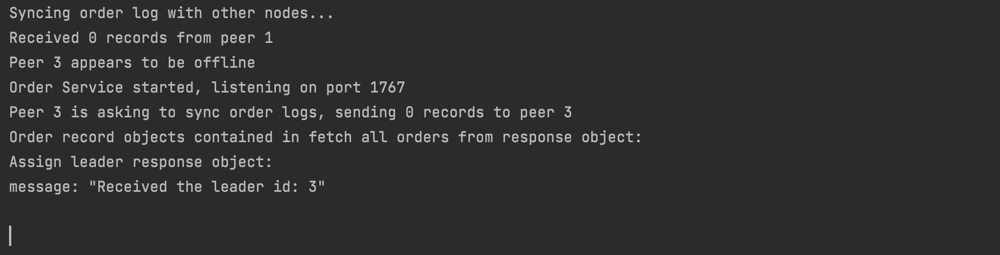
- Order Service id 1: 
- Gateway Service: 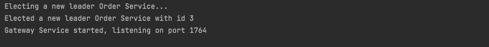

2. Test query, buy, and get order functionality
- Client configuration: pr = 0.5 to test that buys are sent with probability 0.5. r = 10 for 10 requests
- Output: the outputs below show that orders are sometimes placed
  after queries when pr is set to 0.5, which is expected. Also, 
we can see from the Order Service outputs that the leader (service 3)
is servicing buy requests and propagating the data to the replica services. Also,
the output from the gateway server and the Catalog Service shows that the 
LRU cache is being updated and used to respond quickly to query requests.

- Client: 
- Gateway Service: .png)
    .png)
    .png)
- Catalog Service: .png)
.png)
- Order Service id 3: .png)
.png)
- Order Service id 2: 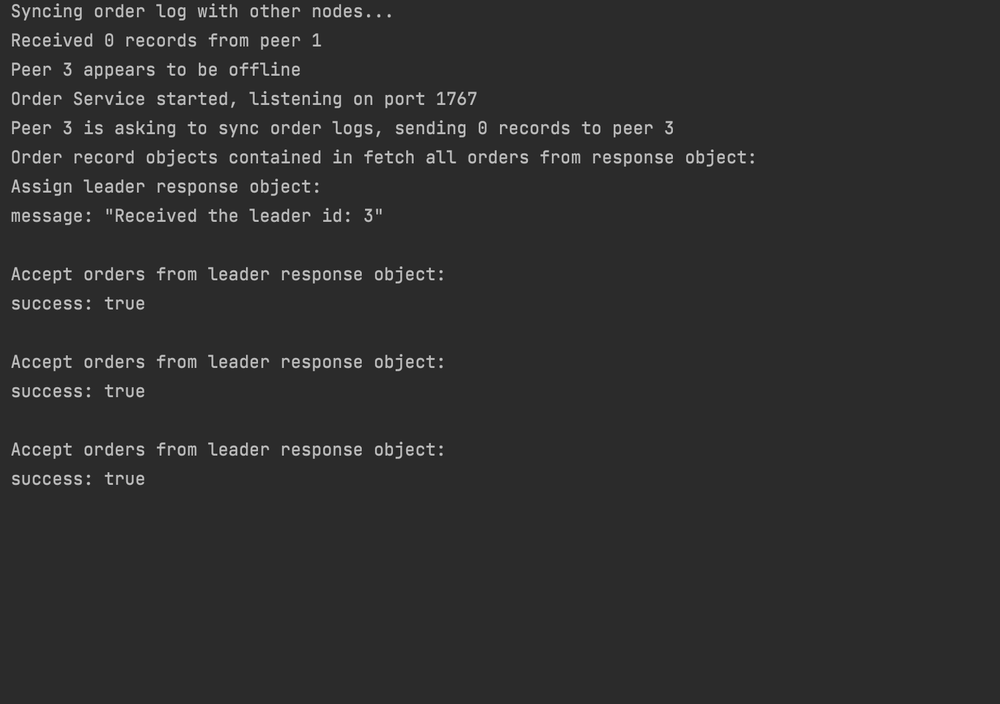
- Order Service id 1: 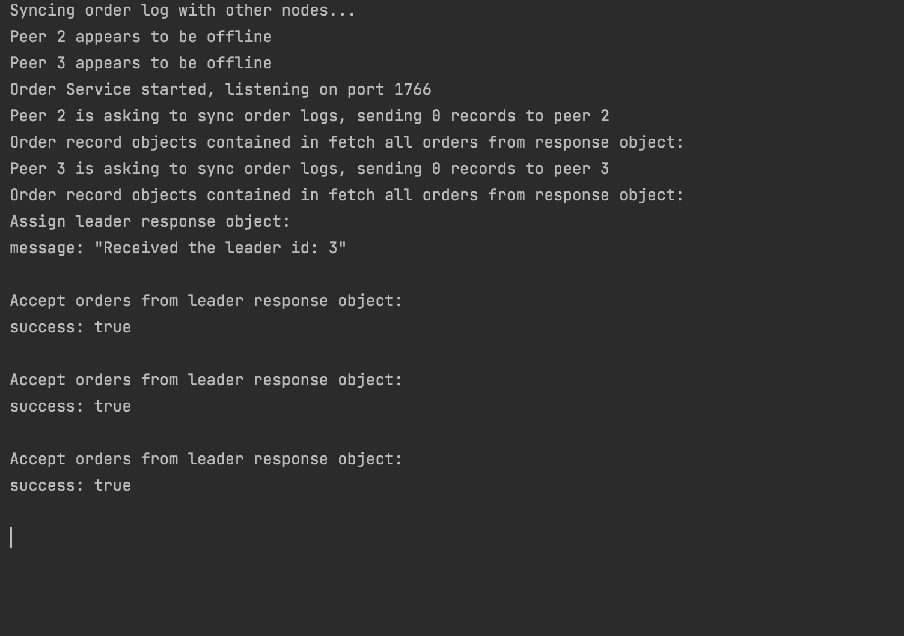

3. Test querying products that do not exist
- Client configuration: query mode activated with m = q, fake product
  mode activated with f, r = 3 for 3 requests
- Output: the outputs below show that errors are being returned
  because the product "Fake" does not exist, which is expected.
  - Client : 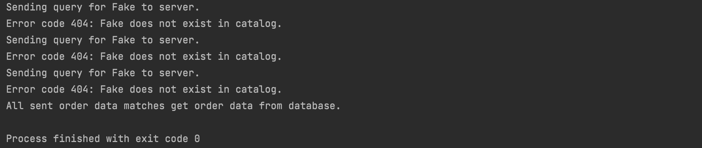
  - catalog : 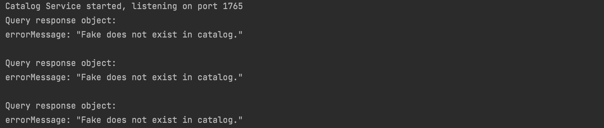
  - gateway : 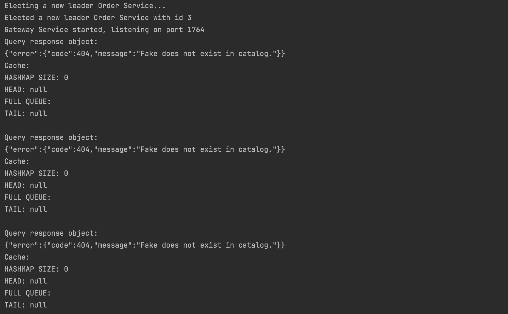

4. Test buying products that do not exist
- Client configuration: buy mode activated with m = b, fake product 
mode activated with f, r = 3 for 3 requests
- Output: the outputs below show that errors are being returned
  because the product "Fake" does not exist, which is expected.
  - Client: 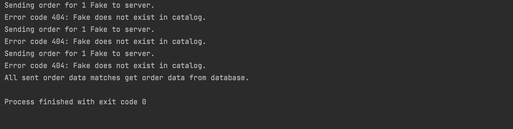
  - Catalog Service: 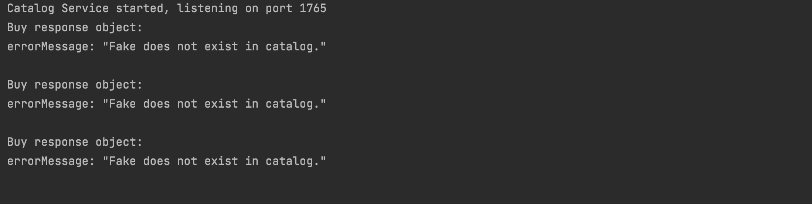
  - Gateway Service: 
  - Order Service: 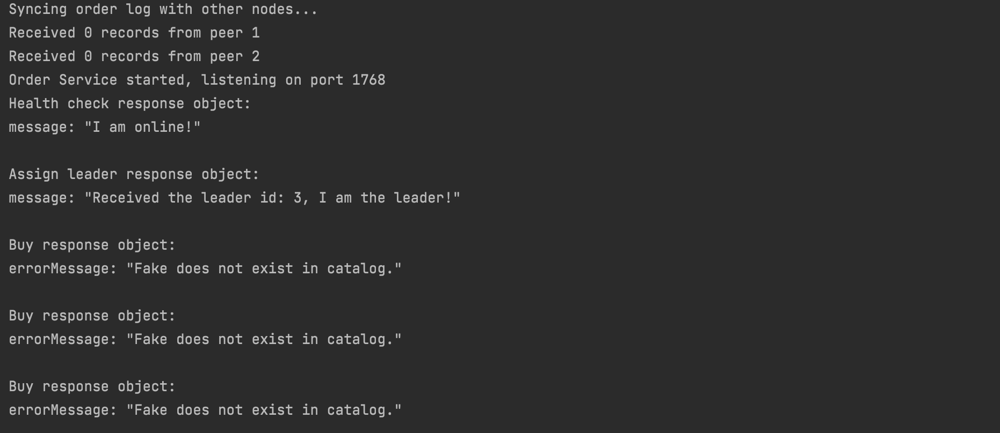

5. Test killing an Order Service replica and bringing it back online
- Client configuration: r = 300 for 300 requests, p = 0.5
- During the Client executing, we killed Order Service replica 2 (non leader) and 
brought it back online
- Output: the output below shows several things. First, all the Client requests
are successfully met without issue, and the database order numbers match what the 
Client sent. The Client does not notice the failures 
(both during order requests and the final order checking phase)
meaning they are transparent to the Client. Second, we can see that when service 2
comes back online, it syncs its database with services 1 and 3, by asking them to 
send orders that it missed out on. We can see the services 1 and 3 sent 179 records
to service 2 for updating its database. Finally, looking at the actual entries in the database files for each service, we can see that all three databases match in terms of number of entries and
the values of their entries.

- Client : 
- Order Service id 3: 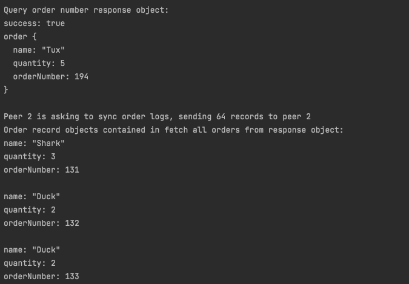
- Order Service id 2: 
- Order Service id 1: 
- Order Service id 3 database: 
- Order Service id 2 database: 
- Order Service id 1 database: 

6. Test killing the leader Order Service replica and bringing it back online
- Client configuration: r = 300 for 300 requests, p = 0.5
- During the Client executing, we killed Order Service 3 (the leader) and
  brought it back online
- Output: the output below shows several things. First, all the Client requests
  are successfully met without issue, and the database order numbers match what the
  Client sent. The Client does not notice the failures
  (both during order requests and the final order checking phase)
  meaning they are transparent to the Client. Second, we can see that
from the Gateway Service output that when the leader dies, it chooses
to elect a new leader and selects service 2 (as it has the next highest
id). Finally, looking at the actual entries in the
  database files for each service, we can see that all 
three databases match in terms of number of entries and
  the values of their entries.
- Client: 
- Gateway Service: .png)
.png)
- Order Service id 3 database: 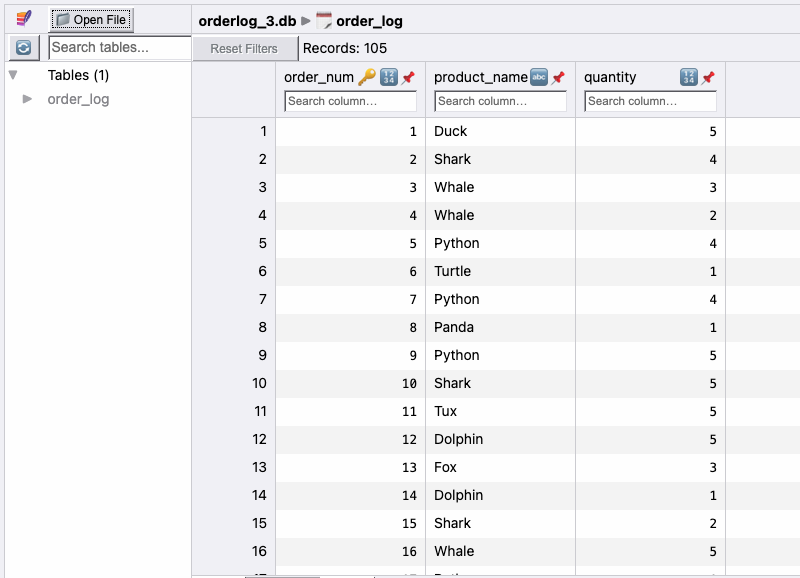
- Order Service id 2 database: 
- Order Service id 1 database: 

Aside from the above test case, the LRUCache was also tested separately to ensure proper
function. In the /src/gateway-service/src/test/java/com/dixon/gateway directory, the LRUCacheTest class 
tests putting items into the cache, getting items from the cache, invalidating items in the
cache, putting items back into the cache after invalidation, and finally updating an
item that is already in the cache. The output of running the main method in the class
shows the following: 
- Items are able to be successfully added to the cache and the cache 
size will not grow larger than it's specified size.

- If the cache is already at maximum capacity, when an item is added, the least recently accessed
or added item is removed (item at the back of the LRUQueue).

- Getting items from the cache moves whatever item get is called on to the front of the LRU queue.
- Invalidating items removes them from the cache.

- The cache can shrink back down to zero if all items are invalidated.

- Items can be added back in to the cache after it shrinks down to zero.

- Items already in the cache can be updated successfully and are successfully moved
to the front of the LRU queue.