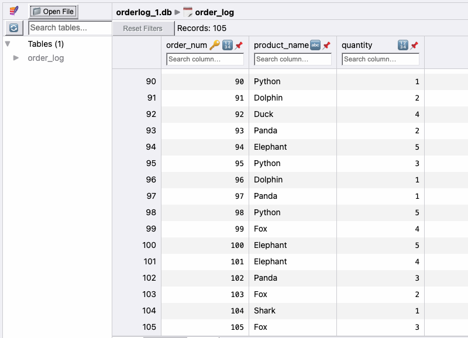

# Testing and Evaluation

## Table of Contents
- [Functional Testing](#functional-testing)
- [LRU Cache Testing](#lru-cache-testing)
- [Latency Performance Evaluation](#latency-performance-evaluation)

## Functional Testing

The following test cases are used to verify that the application works as expected.
In each scenario, the Gateway Service, Catalog Service, and three
Order Service instances are run with the `-te` argument so that they print the objects 
they send via HTTP or gRPC to the standard output before sending them. 
The application is run with the default configuration defined in the [Getting Started](https://github.com/noahdixon/toystore?tab=readme-ov-file#getting-started)
section of the [Design Document](DesignDoc.md). The Client configuration is varied for each
test and the command line arguments used to set the configuration are stated.
For each test case, the standard outputs for the applicable services and/or Client are all
captured in a screenshot, placed in the `test_snips` directory, and shown below.

1. **Test Initial Leader Election**
- The initial leader election functionality is tested by starting three Order Services,
the Catalog Service, and the Gateway Service.

- Output: the outputs below show that Order Service 3 is elected as the leader since
it has the highest id, and that all three Order Services are aware of this.

- Order Service ID 1: 
- Order Service ID 2: 
- Order Service ID 3: 
- Gateway Service: 

2. **Test Query Product, Buy Product, and Query Order Functionality**
- Client configuration: `-pr 0.5` to test that buys are sent with probability 0.5. `-r 10` for 10 requests

- Output: The outputs below show that orders are sometimes placed
  after queries when pr is set to 0.5 and the order
quantity varies from 1 to 5, which is expected. Also, 
we can see from the Order Service outputs that the leader (Service 3)
is servicing buy requests and propagating the data to the replica services. Also,
the output from the Gateway Service and the Catalog Service shows that the 
LRU cache is being updated and used to respond quickly to query requests.

- Client: 
- Gateway Service: .png)
    .png)
    .png)
- Catalog Service: .png)
.png)
- Order Service ID 1: 
- Order Service ID 2: 
- Order Service ID 3: .png)
  .png)

3. **Test Querying Products That Do Not Exist**

- Client configuration: Query mode activated with `-m q`, fake product
  mode activated with `-f`, `-r 3` for 3 requests.

- Output: The outputs below show that errors are being returned
  because the product "Fake" does not exist, which is expected.

  - Client: 
  - Catalog Service: 
  - Gateway Service: 

4. **Test Buying Products That Do Not Exist**
- Client configuration: Buy mode activated with `-m b`, fake product 
mode activated with `-f`, `-r 3` for 3 requests.

- Output: The outputs below show that errors are being returned
  because the product "Fake" does not exist, which is expected.

  - Client: 
  - Catalog Service: 
  - Gateway Service: 
  - Order Service ID 3 (leader): 

5. **Test Killing an Order Service Replica and Bringing it Back Online**

- Client configuration: `-r 300` for 300 requests, `-pr 0.5`

- During the Client execution, Order Service replica 2 (non leader) is killed and 
brought back online.

- Output: the output below shows several things. First, all the Client requests
are successfully met without issue, and the database order numbers match what the 
Client sent. The Client does not notice the failures 
(both during order requests and the final order checking phase)
meaning they are transparent to the Client. Second, we can see that when Service 2
comes back online, it syncs its database with Services 1 and 3, by asking them to 
send orders that it missed out on. We can see that Services 1 and 3 send 179 records
to Service 2 for updating its database. Finally, looking at the actual entries in the database files for each service, 
we can see that all three databases match in terms of number of entries and
the values of their entries.

- Client : .png)
...
  .png)
- Order Service ID 1: 
- Order Service ID 2 (after rebooting): 
- Order Service ID 3: 
- Order Service ID 1 database: 
- Order Service ID 2 database: 
- Order Service ID 3 database: 

6. **Test Killing the Leader Order Service Replica and Bringing it Back Online**
- Client configuration: `-r 300` for 300 requests, `-pr 0.5`

- During the Client execution, Order Service replica 3 (the leader) is killed and
  brought back online.

- Output: the output below shows several things. First, all the Client requests
  are successfully met without issue, and the database order numbers match what the
  Client sent. The Client does not notice the failures
  (both during order requests and the final order checking phase)
  meaning they are transparent to the Client. Second, we can see that
from the Gateway Service output that when the leader dies, it chooses
to elect a new leader and selects Service 2 (as it has the next highest
ID). Finally, looking at the actual entries in the
  database files for each service, we can see that all 
three databases match in terms of number of entries and
  the values of their entries.

- Client: .png)
...
.png)
- Gateway Service: 

- Order Service ID 1: 

- Order Service ID 2: 

- Order Service ID 3 (after rebooting): 

- Order Service ID 1 database: 

- Order Service ID 2 database: 

- Order Service ID 3 database: 

## LRU Cache Testing

The `LRUCache` is tested separately to ensure proper function. 
In the `src/gateway-service/src/test/java/com/dixon/gateway` directory, the `LRUCacheTest` class 
tests putting items into the cache, getting items from the cache, invalidating items in the
cache, putting items back into the cache after invalidation, and finally updating an
item that is already in the cache. The output of running the main method in the class
shows the following: 

- Items are able to be successfully added to the cache and the cache 
size will not grow larger than it's specified size.

- If the cache is already at maximum capacity, when an item is added, the least recently accessed
or added item is removed (item at the back of the LRUQueue).

- Getting items from the cache moves whatever item get is called on to the front of the LRU queue.

- Invalidating items removes them from the cache.

- The cache can shrink back down to zero if all items are invalidated.

- Items can be added back in to the cache after it shrinks down to zero.

- Items already in the cache can be updated successfully and are successfully moved
to the front of the LRU queue.

  
## Latency Performance Evaluation

In order to evaluate the Toy Store's performance under increasing user load, the `run_clients.sh` bash script
located in the `src` directory is used to start multiple Client processes concurrently and record their output
to text files located in the `src\out` directory. The Clients in this case are run with the `-l` argument, which
instructs the Client to output only the average query and average buy request latency in
the form "<query latency>,<buy latency>". The bash script firsts runs a single Client process to completion,
then starts two Clients concurrently and waits for both to complete, then three and so on up ten concurrent Clients.
The number of requests each Client sends can be passed as a command line argument to the script, and in this test
300 requests were sent by each Client (150 queries and 150 buys, because the `-pr` argument is set to 1).
After the results have been sent to the `out` directory, the `graph_latencies.py` python script is used to plot
the results showing how the latency changes for queries and buys with increasing users:

The plot shows that as the number of clients increased, the latency seen by the client for both queries and
buys increased as well. This trend begins mostly above 4 concurrent clients, which makes sense because the
application was run on a Macbook Pro with a 2.5 GHz Quad-Core Intel Core i7 processor. With 4 cores the 
processor is able to concurrently handle requests from 4 clients, and with more clients the requests have
to be queued.

